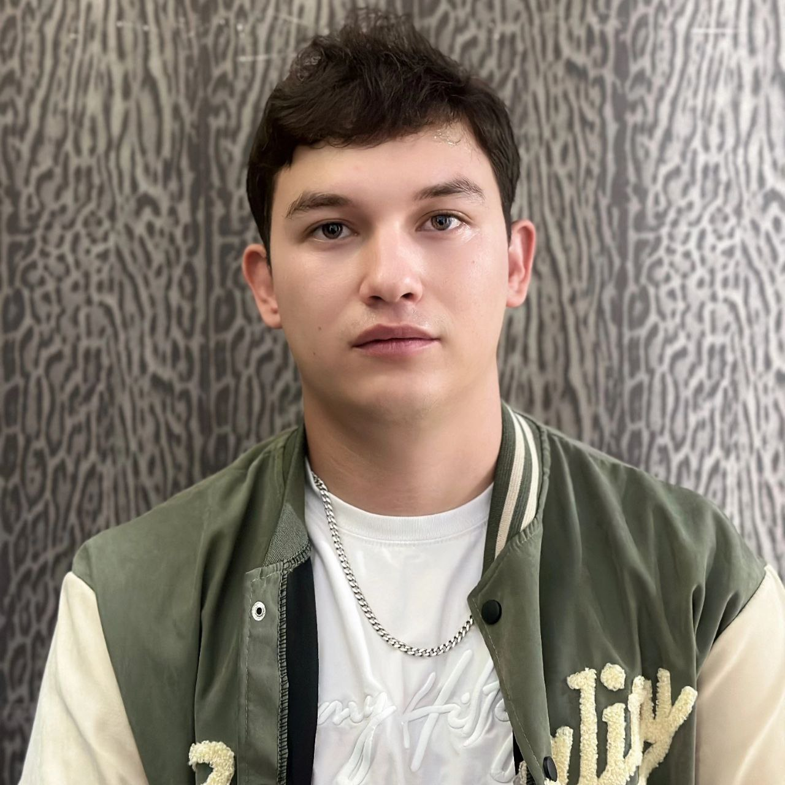

<h1 align="center">Hi there, I'm Alexander

</h1>

###

###

###

- 🔭 I’m currently working on [crm-shoro](https://github.com/sydykovkanat/crm-shoro)

- 🌱 I’m currently learning ****React Native** and **Next.js**!**

- 👯 I’m looking to collaborate on [Tasker](https://github.com/sydykovkanat?tab=repositories)

- 💬 Ask me about ****React Native**, **Next.js**, **JavaScript**, or anything related to **frontend development**!**

- 📫 How to reach me **alexandermokeichuk2001@gmail.com**

###

  
  
  
  
  
  
  
  
  
  
  
  
  
  
  
  
  
  
  
  
  
  
  
  
  
  
  
  
  
  
  
  
  

###

  
  

###

  
  
  

###

 

###

  

  

###
